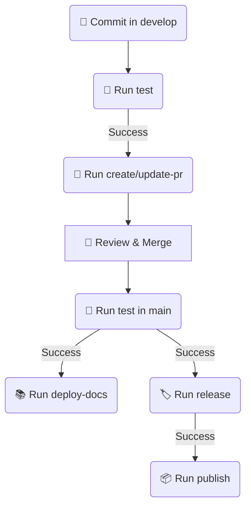

# 🚀 ci-templates: 

### Hub de Workflows e Actions Reutilizáveis para GitHub Actions

Este repositório serve como um hub centralizado para **Workflows** e **Actions** de GitHub Actions, com o objetivo de fornecer uma estrutura de **CI/CD** padronizada e reutilizável entre múltiplos projetos.

A padronização inicial é focada em stacks **Node.js**, **.NET** e *outros (wip)*, cobrindo o ciclo completo de desenvolvimento, desde testes até a publicação de pacotes e releases semânticos.

## 🎯 Fluxo de Trabalho (Develop → PR → Main → Release)

O fluxo CI/CD é projetado para suportar o modelo **Git Flow simplificado**, utilizando `develop` como branch de feature e `main` como branch estável.


## 📦 Estrutura do Repositório
Os workflows são organizados por stack, e as actions comuns são centralizadas para máxima reutilização:

      ci-templates/
      ├── .github/
      │   ├── workflows/
      │   │   ├── node-*.yml      # Workflows para Node.js
      │   │   ├── dotnet-*.yml    # Workflows para .NET
      │   │   └── actions/   # Actions comuns e reutilizáveis
      └── README.md


## 🛠️ Instruções de Uso
Para usar estes templates em seu repositório consumidor (my-project), você deve chamar os workflows usando a sintaxe workflow_call.

Exemplo de Inclusão de Workflow (Node.js)
Crie um arquivo .github/workflows/ci.yml no seu projeto consumidor:

```yml
name: Continuous Integration Node.js

on:
  push:
    branches: [develop] # Dispara em novos commits no develop
  pull_request:
    branches: [develop]
  # Permite chamadas manuais (opcional)
  workflow_dispatch:

jobs:
  run_node_tests:
    # 1. Executa o workflow de testes (test.yml)
    uses: NOME_DO_USUARIO/ci-templates/.github/workflows/node/test.yml@main
    with:
      node_version: '20.x'
      package_manager: 'npm'
      # ... outros inputs

  create_auto_pr:
    # 2. Executa o workflow de PR, dependendo do sucesso dos testes
    needs: run_node_tests
    if: success() && github.event_name == 'push' && github.ref == 'refs/heads/develop'
    uses: NOME_DO_USUARIO/ci-templates/.github/workflows/node/pr.yml@main
    secrets:
      GITHUB_TOKEN: ${{ secrets.GITHUB_TOKEN }}
```      

## 💡 Ação Híbrida do Semantic Release
A action semantic-release (.github/workflows/actions/common/semantic-release) implementa uma lógica híbrida de configuração:

1. **Prioridade Local**: Ao ser executada, a action procura por um arquivo release.config.js na raiz do repositório consumidor.
2. **Fallback Padrão**: Se o arquivo local não for encontrado, ela utiliza o release.config.js que está dentro do próprio template (ci-templates).

Isso permite que você tenha um comportamento de release padronizado na maioria dos projetos, mas a flexibilidade de personalizar plugins e regras de branch em projetos específicos, se necessário.

**Plugins Inclusos (Padrão)**
A action instala automaticamente e utiliza os seguintes plugins em seu package.json para garantir que o fluxo base funcione:

- semantic-release
- @semantic-release/git
- @semantic-release/github
- @semantic-release/changelog
- @semantic-release/npm (Pode ser desabilitado via config local)
- @semantic-release/release-notes-generator

## 🔑 Variáveis de Ambiente e Secrets Necessários

Para que os workflows e actions funcionem corretamente, seu repositório consumidor deve ter os seguintes secrets configurados no GitHub:

Secret |	Descrição |	Uso em Workflows
-- | -- | --
GITHUB_TOKEN |	Token padrão fornecido pelo GitHub. Necessário para criar PRs, Releases e Tags. Deve ter permissão de escrita (contents: write, pull-requests: write).	| pr.yml, release.yml
NPM_TOKEN |	Token de acesso para o registry do NPM ou GitHub Packages.	| node/release.yml, node/publish.yml
NUGET_API_KEY |	Chave de API para autenticação e publicação no feed NuGet (e.g., nuget.org). |	dotnet/publish.yml
NPM_CONFIG_REGISTRY |	URL do registry, se for diferente do padrão (e.g., GitHub Packages). |	node/publish.yml (como input)